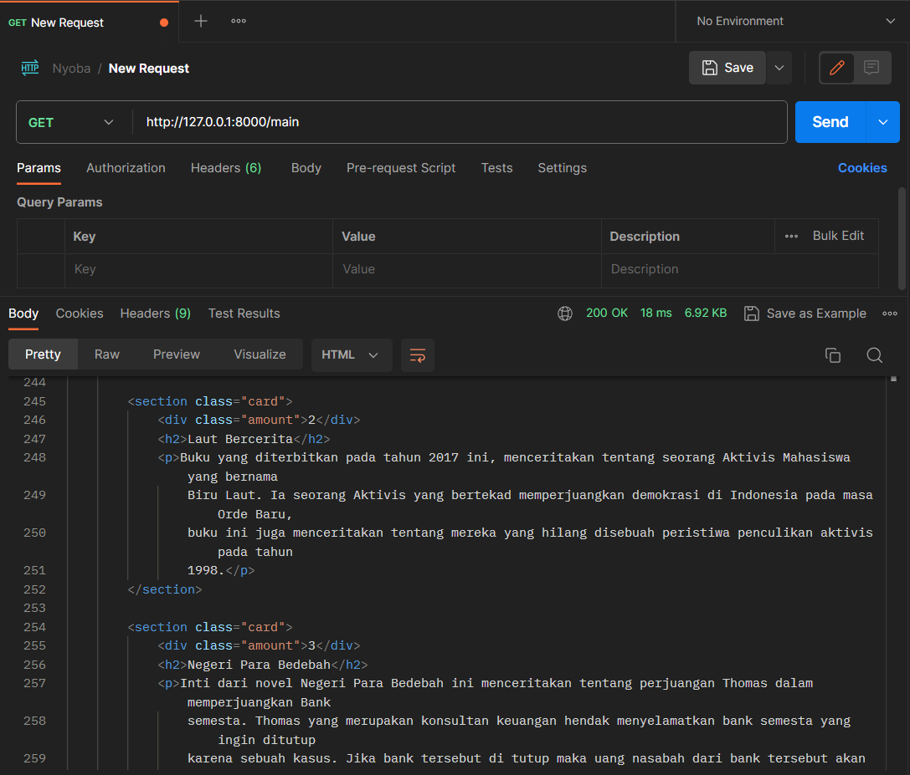
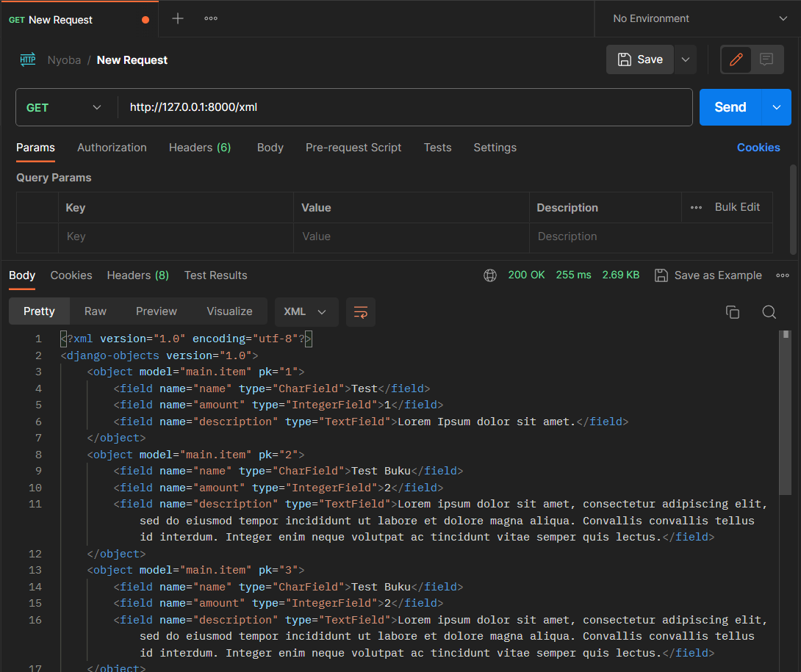
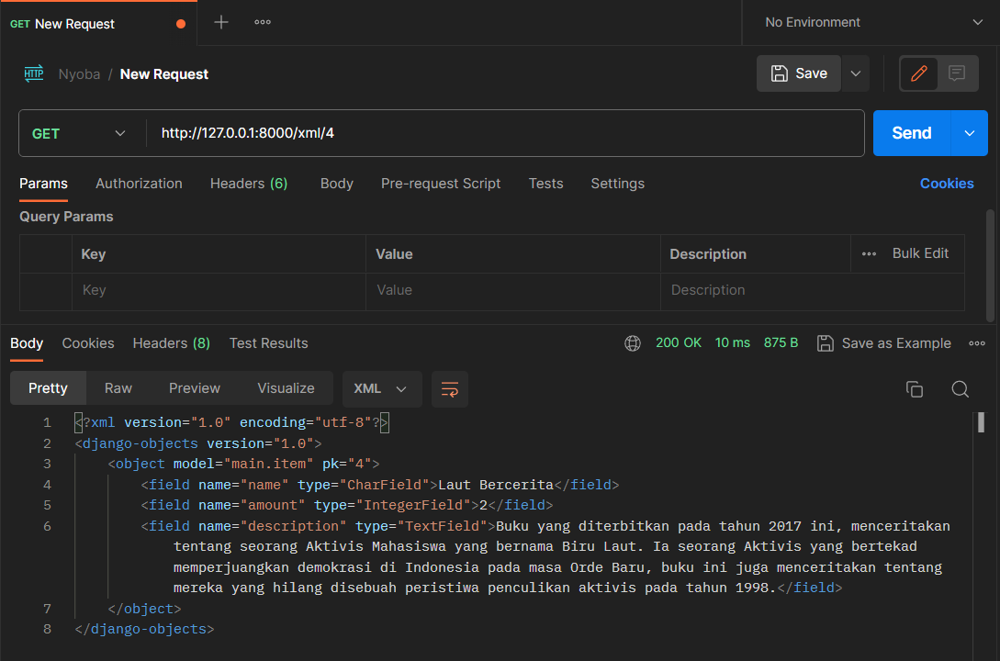
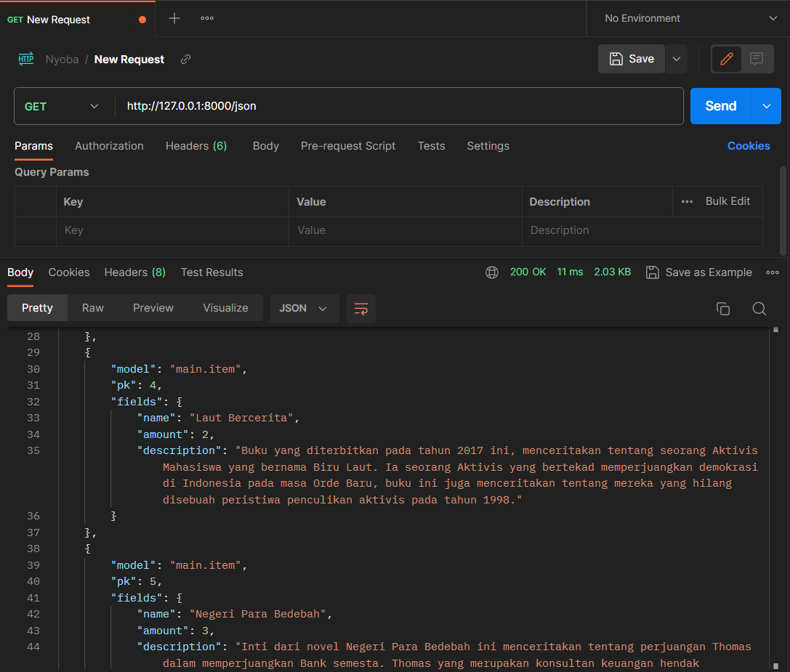
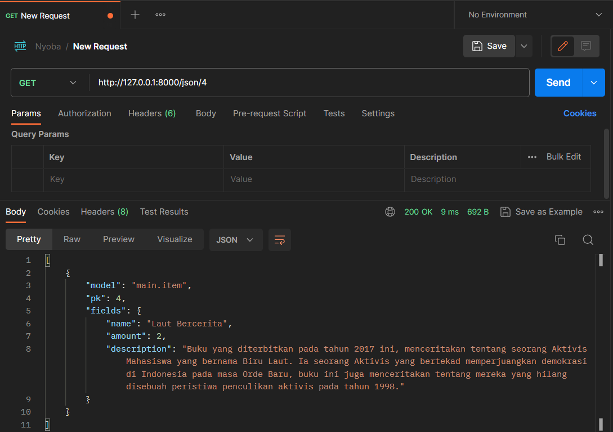

# COLLETION BOOK
**Nama**    : **Restu Ahmad Ar Ridho** <br/>
**NPM**     : **2206028951** <br/>
**Kelas**   : **PBP - E**


# List README Tugas Sebelumnnya
### - [README TUGAS 2](./src/README/README_2.md)


# Apa perbedaan antara form POST dan form GET dalam Django?

|    **POST**   |    **GET**    |
| :-----------: | :-----------: |
| Data dikirim dalam _body_ permintaan HTTP, yang biasanya tidak terlihat oleh pengguna. Berguna ketika ingin mengirim data sensitif | Data akan disertakan dalam URL hal ini membuat data terlihat pada URL _browser_. Umumnya digunakan untuk permintaan pencarian atau ketika ingin berbagi URL yang mencakup parameter tertentu.  |
| Biasanya digunakan ketika ingin mengirim data yang lebih besar atau lebih kompleks, seperti teks panjang, file, atau data yang rahasia.  | Cocok untuk data yang lebih kecil dan sederhana, seperti parameter pencarian atau pemfilteran data (_query_).  |
| Data yang dikirim dengan metode POST tidak terlihat di URL, sehingga lebih aman untuk data sensitif. Selain itu, dapat mengamankan formulir POST dengan token CSRF untuk melindungi dari serangan Cross-Site Request Forgery (CSRF).  | Data yang dikirim dengan metode GET terlihat di URL, sehingga tidak cocok untuk data sensitif.  |
| Permintaan POST tidak akan di-_cache_ oleh _browser_ atau _proxy server_ secara _default_ karena mereka dianggap mengubah data di _server_.  | Permintaan GET bisa saja di-_cache_ oleh _browser_ atau _proxy server_, yang berarti hasil pencarian atau tampilan halaman dapat disimpan dalam _cache_.  |

# Apa perbedaan utama antara XML, JSON, dan HTML dalam konteks pengiriman data?
|  **XML**  | **JSON**  | **HTML**  |
| :---: | :---: | :---: |
|**JSON** adalah singkatan dari JavaScript Object Notation. | **XML** adalah singkatan dari Extensible Markup Language. | **HTML** adalah singkatan dari Hypertext Markup Language.|
| XML dirancang untuk menyimpan dan mengirimkan data serta menjaga struktur data yang kuat. Sering digunakan dalam konteks pertukaran data antara sistem yang berbeda atau penyimpanan data dalam format yang dapat diurai. | JSON awalnya dikembangkan untuk digunakan dengan JavaScript, tetapi sekarang merupakan format data yang populer untuk pertukaran data dalam aplikasi web.  | HTML adalah _hypertext_ yang digunakan untuk menggambarkan struktur dan tampilan halaman web. HTML bukan format pertukaran data, melainkan format untuk menampilkan data di web. |
| XML menggunakan tag untuk mendefinisikan struktur data. Setiap elemen data dikelilingi oleh tag pembuka dan penutup yang membantu menjaga hierarki dan hubungan antara elemen-elemen data. 	 Perlu mengurai XML dengan pengurai XML. | JSON menggunakan format objek dan array untuk menyimpan data. Ini mirip dengan struktur data dalam JavaScript, yang membuatnya mudah diurai dan digunakan dalam kode JavaScript. | HTML menggunakan tag untuk menentukan elemen-elemen pada halaman web, seperti teks, gambar, hyperlink, formulir, dan banyak lagi. Memiliki struktur yang sangat berbeda dari XML dan JSON, karena tujuannya adalah untuk merender konten web. |
| XML dirancang untuk dapat dibaca oleh mesin dan manusia, sehingga sering digunakan dalam berbagai aplikasi yang memerlukan interoperabilitas antara sistem yang berbeda. Sintaksis XML mengganti beberapa karakter untuk referensi entitas sehingga membuatnya menjadi lebih bertele-tele. | JSON mudah dibaca oleh mesin dan juga cukup mudah dibaca oleh manusia, meskipun tidak sejelas XML dalam hal hierarki.  | HTML dirancang untuk ditampilkan oleh browser web dan tidak memiliki tujuan untuk pertukaran data. Namun, HTML dapat menampilkan data dan meminta input melalui _tag input_ dan metodenya|
|Harus mematikan DTD ketika bekerja dengan XML untuk memitigasi potensi risiko keamanan.|JSON lebih aman dibandingkan dengan XML. | --

# Mengapa JSON sering digunakan dalam pertukaran data antara aplikasi web modern?
JSON adalah format pertukaran data berbasis teks yang mengikuti sintaksis objek JavaScript. JSON sering digunakan dalam pertukaran data antara aplikasi web modern karena memiliki sejumlah keunggulan, yaitu:
1. JSON memiliki format yang ringan sehingga menghasilkan ukuran data yang relatif kecil, yang memungkinkan transfer data yang lebih cepat antara server dan klien. Kecilnya ukuran data JSON adalah keuntungan utama saat beroperasi dengan perangkat berkecepatan rendah atau koneksi internet yang lambat.
2. JSON menggunakan format objek dan array yang mirip dengan struktur data dalam JavaScript. Ini membuatnya mudah dibaca dan ditulis dalam kode. Dalam JavaScript, kita dapat mengurai (`parse`) dan menghasilkan (`stringify`) objek JSON dengan mudah menggunakan fungsi built-in.
3. JSON tidak terkait dengan bahasa pemrograman tertentu. JSON dapat digunakan dengan berbagai bahasa pemrograman, tidak hanya JavaScript. Hal ini memungkinkan interaksi antara berbagai bahasa dalam ekosistem pengembangan web.
4. Hampir semua browser web modern mendukung JSON. Memungkinkan klien web untuk dengan mudah berkomunikasi dengan server menggunakan JSON sebagai format pertukaran data.
5. JSON sangat cocok dengan pendekatan gaya arsitektur API RESTful, yang sering digunakan dalam pengembangan web modern. API RESTful menggunakan HTTP request methods seperti `GET`, `POST`, `PUT`, `DELETE` untuk berinteraksi dengan sumber daya (_resource_) menggunakan JSON sebagai format pertukaran data standar.
6. JSON biasanya mudah dikelola dalam kode karena strukturnya yang serupa dengan objek dan array dalam banyak bahasa pemrograman. Hal ini membuat pengolahan data JSON menjadi lebih sederhana.

# Implementasi Setiap Step
Sebelumnya, mengubah susunan templates dengan menggunakan `base.html` sebagai base html dan digunakan dalam `templates` pada direktori `main` dan susunan README.md. Mengubah beberapa kode pada `views.py` di direktori `main` pada _function_ `show_main` yang mem-_passing_ data yang sesuai jika belum terdapat item pada database dan juga pada _function_ `show_landing_page` yang menampilkan data Nama dan Kelas
## Membuat Input `form` Untuk Menambahkan Objek Model
1. Membuat berkas baru pada direktori `main` dengan nama `forms.py` untuk membuat struktur form agar sesuai dengan models `Item` yang telah kita buat. Kemudian isi dengan kode
    ```python
    from django.forms import ModelForm
    from main.models import Item

    class ItemForm(ModelForm):
        class Meta:
            model = Item
            fields = ["name", "amount", "description"]
    ```
2. Pada `views.py` dalam direktori `main` kita import struktur form yang sudah dibuat dan beberapa _function_ dan _class_ untuk melakukan _redirect_ url dengan kode
    ```python
    from django.http import HttpResponseRedirect
    from main.forms import ItemForm
    from django.urls import reverse
    ```
3. Kemudian menambahkan _function_ baru untuk menampilkan `tambah_buku.html` yang akan dibuat dan menerima data dari method `POST` dengan kode
    ```python
    def create_book(request):
    form = ItemForm(request.POST or None)

    if form.is_valid() and request.method == "POST":
        form.save()
        return HttpResponseRedirect(reverse('main:show_main'))

    return render(request, "tambah_buku.html")
    ```
4. Melakukan _routing_ di berkas `urls.py` di direktori `main` dengan meng-_import method_ `create_book` dari `views.py` dengan menambahkan kode
    ```python
    ...
    from main.views import show_main, show_landing_page, create_book

    ...

    urlpatterns = [
      ...,
      path('tambah_buku/', create_book, name='show_tambah_buku'),
      ...
    ]
    ```
5. Membuat berkas HTML dengan nama `tambah_buku.html` pada direktori `main/templates` dengan kode yang tertera pada file tersebut.

## Tambahkan 5 Fungsi Views Untuk Melihat Objek yang Sudah Ditambahkan dalam Format HTML, XML, JSON, XML by ID, dan JSON by ID.
### Format HTML
1. Dalam format html sudah dilakukan pada tugas 2 yaitu dengan membuat berkas html `main.html` untuk menampilkan data yang telah ditambahkan. 
2. Membuat _function_ pada `views.py` di direktori mian dengan kode
    ```python
    def show_main(request):
    Items = Item.objects.all()

    if ((Items.count() == 0)):
      context = {
          'data' : default_book
      }
    else:
      context = {
          'data' : Items
      }

    return render(request, "main.html", context)
    ```
    > Penjelasan singkat jika Item kosong maka akan menggunakan item default sebagai _dummy_ jika ada maka menggunakan data dari Item

### Format XML dan XML by ID
1. Membuat _function_ baru dalam berkas `views.py` dalam direktori `main` dengan nama `show_xml` untuk menampilkan format XML dan `show_xml_by_id` untuk menampilkan format XML dengan ID tertentu.
2. Untuk `show_xml` yang menampilkan semua data maka ditambahkan kode untuk mengambil data dengan `Item.objects.all()` dan untuk `show_xml_by_id` yang menampilkan data dengan ID tertentu ditambahkan kode dengan melakukan filter yaitu dengan `Item.objects.filter(pk=id)`
3. Kemudian data akan diubah menjadi format XML dengan `serializers.serialize("xml",data)` sehingga menampilkan format XML. Kurang lebih kode akan menjadi
    ```python
    def show_xml(request):
      data = Item.objects.all()
      return HttpResponse(serializers.serialize("xml", data), content_type="application/xml")

    def show_xml_by_id(request, id):
      data = Item.objects.filter(pk=id)
      return HttpResponse(serializers.serialize("xml", data), content_type="application/xml")
    ```

### Format JSON dan JSON by ID
1. Kurang lebih sama dengan **Format XML dan XML by ID** namun ada nama fungsi `show_json` untuk menampilkan format JSON dan `show_json` untuk menampilkan format JSON by ID. Sehingga kode pada `views.py` dalam direktori `main` ditambahkan dengan
    ```python
    def show_json(request):
      data = Item.objects.all()
      return HttpResponse(serializers.serialize("json", data), content_type="application/json")

    def show_json_by_id(request, id):
      data = Item.objects.filter(pk=id)
      return HttpResponse(serializers.serialize("json", data), content_type="application/json")
    ```

## Membuat _Routing_ URL untuk Masing-Masing Views yang Telah Ditambahkan
1. Pada format HTML membuat _routing_ agar dapat ditampilkan dengan membuka berkas `urls.py` pada direktori `main` dengan menambahkan kode
    ```python
    urlpatterns = [
      ...
      path('main/', show_main, name='show_main'),
      ...
    ]
    ```
    **Penjelasan _routing_**
    - `http://127.0.0.1:8000/main` akan menampilkan berkas HTML untuk menampilkan buku yang telah ditambahkan
2. Melakukan _routing_ agar _user_ dapat mengakses melalui url dengan membuka berkas `urls.py` pada direktori `main` dan meng-_import_ _function_ yang telah dibuat dan menambah _routing_ dengan kode
    ```python
    ...
    from main.views import show_main, show_landing_page, create_book, show_xml show_xml_by_id

    ...

    urlpatterns = [
        ...
        path('xml/', show_xml, name='show_xml'),
        path('xml/<int:id>/', show_xml_by_id, name='show_xml_by_id')
        ...
    ]
    ```
    **Penjelasan _routing_**
    - `http://127.0.0.1:8000/xml` akan menampilkan format XML
    - `http://127.0.0.1:8000/xml/[id]` akan menampilkan format XML dengan ID [id]
3. Melakukan _routing_ agar _user_ dapat mengakses melalui url dengan membuka berkas `urls.py` pada direktori `main` dan meng-_import_ _function_ yang telah dibuat dan menambah _routing_ dengan kode
    ```python
    ...
    from main.views import show_main, show_landing_page, create_book, show_xml, show_json, show_xml_by_id, show_json_by_id

    ...

    urlpatterns = [
        ...
        path('json/', show_json, name='show_json'), 
        path('json/<int:id>/', show_json_by_id, name='show_json_by_id'), 
        ...
    ]
    ```
    **Penjelasan _routing_**
    - `http://127.0.0.1:8000/json` akan menampilkan format JSON
    - `http://127.0.0.1:8000/json/[id]` akan menampilkan format JSON dengan ID [id]

## Mengakses Kelima URL yand Telah Dibuat Menggunakan Postman
### HTML

> Menampilkan pada HTML yang memuat data

### XML dan XML by ID
#### XML

#### XML by ID


### JSON dan JSON by ID
#### JSON

#### JSON by ID


# BONUS
1. Membuat kondisional _rendering_ pada berkas html yaitu `main.html` pada direktori `main/templates`.
2. Membuka berkas `views.py` pada direktori `main` dan menambahkan kode untuk menyimpan hasil form yang telah di-_input_ kedalam _session_ agar dapat di-_passing_ dari _function_ `create_book` ke `show_main` sehingga dapat menampilkan buku yang telah ditambahkan.
3. Pada _function_ `create_book` saya menggunakan _session_ untuk menyimpan data `name` dan `amount` dan pada _function_ `show_main` dilakukan pengecekan terhadap variabel yang telah disimpan didalam _session_, jika ada maka dikirimkan data `name` dan `amount` ke bagian `context` saat _render_ dan jika tidak ada maka hanya mengirimkan string kosong agar dapat di-_handle_ oleh kondisional _rendering_ pada berkas HTML.