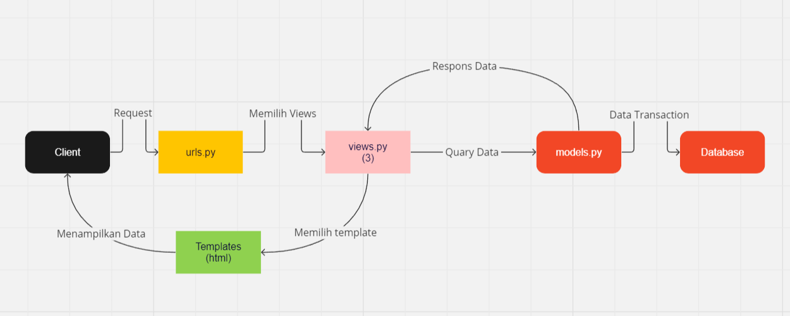

[Book Colletion Adabtable](https://book-collection.adaptable.app/)

# Implementasi Setiap Step

## Membuat Project Baru Django
### 1. Inisiasi Proyek Django
1. Membuka _command prompt_ (Windows) kemudian menuju direktori yang diinginkan.
2. Membuat direktori baru dengan nama `book_collection` dan masuk kedalamnya menggunakan perintah
    ```bash
    mkdir book_collection
    cd book_collection
    ```
3. Di dalam direktori tersebut membuat _virtual environtment_ dengan menjalankan perintah
    ```bash
    python -m venv env
    ```
4. Setelah berhasil membuat _virtual environtment_, kemudian mengaktifkannya dalam Windows dengan perintah
    ```bash
    env\Scripts\activate.bat
    ```
### 2. Menyiapkan _Dependencies_ dan Membuat Proyek Django
1. Di dalam direktori yang sama, buat file `requirements.txt` dan tambahkan _dependencies_ yang diperlukan dengan isi berkas dengan text berikut
    ```text
    django
    gunicorn
    whitenoise
    psycopg2-binary
    requests
    urllib3
    ```
2. Intall atau pasang _dependencies_ yang telah ditambahkan didalam _virtual environtment_ dengan perintah
  ```bash
  pip install -r requirements.txt
  ```
3. Buat aplikasi Django baru bernama `book_collection` dengan perintah
  ```bash
  django-admin startproject book_collection .
  ```
4. Menambahkan `*` pada `ALLOWED_HOSTS` di `settings.py` untuk mengizinkan akses semua host sebagai keperluan _deployment_
  ```python
  ALLOWED_HOSTS = ["*"]
  ```

## Membuat Aplikasi dengan Nama `main`
1. Membuat aplikasi baru dengan nama `main` pada root direktori `book_collection` dengan perintah
  ```bash
  python manage.py startapp main
  ```
2. Mendaftarkan aplikasi yang telah dibuat kedalam proyek Django dengan cara membuka berkas `settings.py` di dalam direktori proyek `book_collection` tambahkan `main` kedalam daftar aplikasi yang ada
  ```python
  INSTALLED_APPS = [
    ...,
    'main',
    ...
  ]
  ```

## Melakukan _Routing_ pada Proyek agar Dapat Menjalankan Aplikasi `main`
1. Buka berkas `urls.py` pada direktori proyek `book_colletion` kemudian import fungsi `include` dari `django.urls`
  ```python
  ...
  from django.urls import path, include
  ...
  ```
2. Tambahkan rute URL untuk mengarahkan aplikasi `main` ke routing `\` di dalam variabel `urlpatterns`
  ```python
  urlpatterns = [
    ...
    path('', include('main.urls'))
    ...
  ] 
  ```
3. Pindah ke dalam direktori ke aplikasi `main` tambahkan berkas `urls.py` untuk melakukan konfigurasi _routing_ dalam aplikasi `main` untuk sekarang bisa dikosongkan terlebih dahulu.

## Membuat Model pada Aplikasi `main` dengan Nama `Item` yang Memiliki Beberapa Atribut Wajib
1. Buka berkas `models.py` pada direktori aplikasi `main` kemudian isi berkas `models.py` dengan kode berikut
  ```python
  class Item(models.Model):
    name = models.CharField(max_length=255)
    amount = models.IntegerField()
    description = models.TextField()
  ```
  > pada model tersebut baru ditambahkan atribut yang wajib
2. Melakukan migrasi model untuk mengubah struktur tabel basis data dengan perintah dalam root direktori
  ```bash
  python manage.py makemigrations
  ```
3. Menerapkan migrasi ke dalam basis data lokal dengan perintah
  ``` bash
  python manage.py migrate
  ```

## Membuat Sebuah Fungsi pada `views.py` untuk Menampilkan Template HTML
1. Sebelumnya membuat direktori `templates` pada direktori aplikasi `main`, kemudian pada direktori `templates` dan menambahkan berkas `main.html` sebagai template html untuk menampilkan koleksi buku
2. Dan untuk _landing page_ pada direktori `templates` menambahkan berkas `landingpage.html` untuk menampilkan nama aplikasi serta nama dan kelas
3. Buka berkas `views.py` kita dapat mengembalikan `main.html` dan `landingpage.html` dengan cara menambahkan sebuah fungsi untuk merespons
  ```python
  def show_landing_page(request):
    return render(request, "landingpage.html")

  def show_main(request):
    context = {
        'data' : [...]
    }

    return render(request, "main.html", context)
  ```

## Membuat _Routing_ pada `urls.py` Aplikasi `main` untuk Memetakan Funsi yang Telah Dibuat pada `views.py`
1. Melakukan konfigurasi _Routing_ dengan menambahkan kode berikut kedalam berkas `urls.py` di direktori `main`
  ```python
  from django.urls import path
  from main.views import show_main, show_landing_page

  app_name = 'main'

  urlpatterns = [
      path('main/', show_main, name='show_main'),
      path('', show_landing_page, name='show_landing_page'),
  ]
  ```
  **Penjelasan Routing**
  - `http://127.0.0.1:8000/` akan menampilkan landingpage.html
  - `http://127.0.0.1:8000/main` akan menampilkan main.html

## _Addition_
  Menambahkan style dan static untuk menampung file static

## Melakukan _Deployment_ ke Adabtable
1. Setelah akun GitHub terhubung maka tekan tombol `New App` dan pilih `Connect an Existing Repository`
2. Pilih repositori yang digunakan yaitu `book-collection` dan pilih branch yang dijadikan _deployment branch_ yaitu `static`
3. Memilih `Python App Template` dan `PostgreSQL` sebagai tipe basis data yang digunakan
4. Menyesuaikan versi Python yang digunakan di _virtual environtment_ dengan menjalankan perintah `python --version`
5. Pada bagian `Start Command` isi dengan perintah `python manage.py migrate && gunicorn book_collection.wsgi`
6. Memasukan nama aplikasi sebagai _domain_ situs web dan setelah itu centang bagian `HTTP Listener on PORT` dan klik `Deploy App` untuk memulai proses _deployment_

# Bagan Berisi _Request Client_ ke Web Aplikasi Berbasis Django Beserta Responnya

1. Request Client ke Aplikasi Django
  - Client mengirim permintaan HTTP ke aplikasi Django melalui browser atau aplikasi lainnya
  - Permintaan ini dikirim ke `urls.py` dalam aplikasi Django kemudian mencocokkan URL permintaan dengan pola URL yang telah didefinisikan
2. `urls.py`
  - Setelah menemukan pola URL yang cocok, `urls.py` akan memanggil permintaan ke `views.py`
3. `views.py`
  - `views.py` berisi logika untuk mengolah permintaan  dan menrespons data yang diperlukan dari Model atau sumber lainnya seperti melakukan _render_ dari template dan melakukan _passing data_ dari `models.py`
4. `models.py`
  - Representasi struktural dari data dalam basis data atau penyimpanan lainnya.
  - `views.py` dapat berinteraksi dengan Model untuk mengambil, memperbarui, atau menyimpan data.
5. Response ke Client:
  - Setelah `views.py` menyelesaikan logikanya, respons HTTP yang berisi data atau `HTML` yang akan ditampilkan di browser dikirimkan kembali ke Client.

# Mengapa Menggunakan _Virtual Environtment_
  Menggunakan _virtual environtment_ memungkinkan kita untuk mengisolasi dependensi dan paket yang diperlukan untuk proyek tertentu. Dengan cara ini, Anda dapat bekerja pada beberapa proyek yang menggunakan versi yang berbeda dari dependensi tanpa konflik sehingga kita dapat dengan mudah untuk mengelola dan menginstal dependensi yang diperlukan untuk proyek tanpa menggabungkan dengan dependensi proyek lainnya. Selain itu, _virtual environment_ membuat pemeliharaan proyek yang lebih mudah karena semua dependensi dan pengaturan yang diperlukan disimpan dalam satu lingkungan yang dapat dikelola secara terpisah. 
  ### Apakah Tetap Dapat Membuat Tanpa Menggunakan _Virtual Environtment_
  Iya, namun kelebihan yang telah disebutkan sebelumnya tidak akan terjadi.
  

# MVC, MVT, MVVM
1. **MVC** (Model View Controller) adalah sebuah _design pattern_ yang digunakan dalam pengembangan perangkat lunak dengan tujuan untuk memisahkan data (Model) dari tampilan (View) dan cara bagaimana cara memprosesnya (Controller). Penjelasan setiap komponen:
  - Model: bagian yang bertugas untuk menyiapkan, mengatur, memanipulasi, dan mengorganisasikan data yang ada di database.
  - View: bagian yang bertugas untuk menampilkan informasi dalam bentuk Graphical User Interface (GUI).
  - Controller: bagian yang bertugas untuk menghubungkan serta mengatur model dan view agar dapat saling terhubung.
  
  > source: https://www.dicoding.com/blog/apa-itu-mvc-pahami-konsepnya/
2. **MVT** (Model View Template) adalah sebuah _design pattern_ yang merupakan turunan dari struktur **MVC** yang digunakan dalam _framework_ Django yang membagi komponen menjadi Model-View-Template. Perbedaan utama antara MVT dan MVC adalah penggunaan "Template" dalam MVT yang memisahkan tampilan dengan cara yang lebih eksplisit dan memungkinkan pemisahan yang lebih kuat antara tampilan dan logika dan _framework_ itu sendiri yang menangani bagian control
Penjelasan setiap komponen:
 - Model: Sebagai objek yang mendefinisikan entitas pada database beserta konfigurasinya 
 - View: Logika utama dari aplikasi yang akan melakukan pemrosesan terhadap permintaan yang masuk
 - Template: sebagai tampilan yang akan dikembalikan kepada pengguna
  
  > source: https://prasetyadi.name/2021/pengantar-framework-django/
3. **MVVM** (Model View ViewModel) adalah salah satu _design pattern_ pembuatan aplikasi berbasis GUI yang berfokus pada pemisahan antara kode untuk logika bisnis dan tampilan aplikasi. MVVM terbagi atas tiga lapisan yaitu Model, View, dan ViewModel yang memungkinkan untuk pemisahan kerja yang lebih baik antara UI dan logic.
Penjelasan setiap komponen:
- Model: mengelola data dan logika bisnis aplikasi yang didapatkan dari _ViewModel_ setelah menerima input dari _View_
- View: representasi visual dari antarmuka pengguna (UI) dalam aplikasi
- ViewModel: berada di antara layer view dan model dan berfungsi sebagai penghubung keduanya yang mendapatkan input dari view mengenai aktivitas pengguna dan melakukan _data binding_ dua arah.
  
  > source: https://revou.co/kosakata/mvvm

  ## Perbedaan MVC, MVT, dan MVVM
  1. MVC (Model-View-Controller):
    - Model digunakan untuk mengelola data.
    - View bertanggung jawab untuk menampilkan data kepada pengguna dan mengumpulkan input pengguna.
    - Controller mengatur aliran program, menerima input dari pengguna melalui View, dan berkomunikasi dengan Model.
    - Biasanya digunakan dalam pengembangan aplikasi web dan desktop.
  2. MVT (Model-View-Template):
    - Model tetap bertanggung jawab untuk mengelola data.
    - View bertanggung jawab untuk menampilkan data kepada pengguna dan logika utama yang melakukan pemrosesan terhadap permintaan yang masuk
    - Template adalah komponen tambahan yang mengatur cara tampilan web dibangun dan disusun.
    - Mirip dengan MVC, tetapi digunakan dalam _framework_ web Django.
  3. MVVM (Model-View-ViewModel):
    - Model bertanggung jawab untuk mengelola data.
    - View merupakan antarmuka pengguna (UI) yang menampilkan data dan merespons tindakan pengguna.
    - ViewModel adalah perantara antara Model dan View yang menghubungkan data Model ke tampilan View dan berisi logika bisnis terkait tampilan.
    - Digunakan khususnya dalam pengembangan aplikasi berbasis antarmuka pengguna (UI), terutama aplikasi mobile dan desktop.

# Bonus
  Menyelesaikan implementasi _testing_ dasar yang dapat dilihat pada `./main/tests.py` yang melakukan _testing_ untuk Model data dan response _routing_ dengan menjalankan perintah `python manage.py test`
  
  